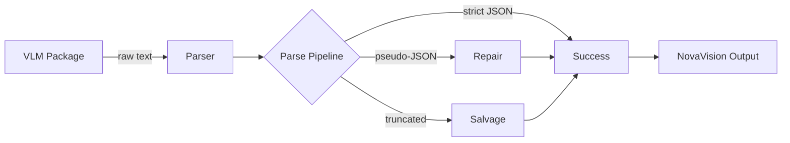
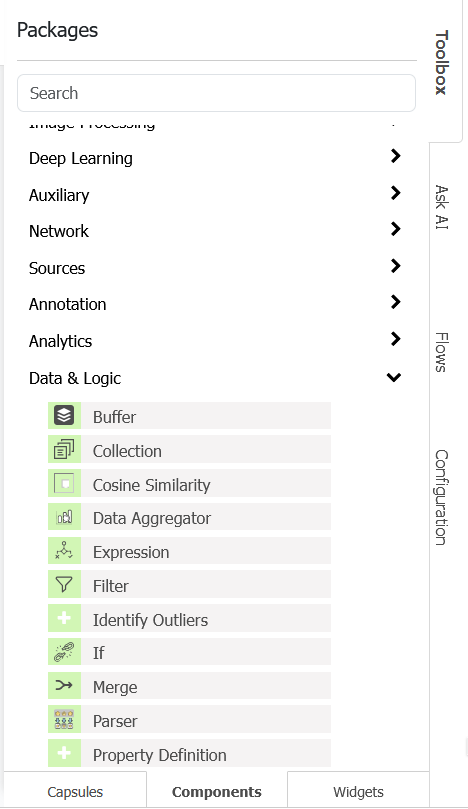
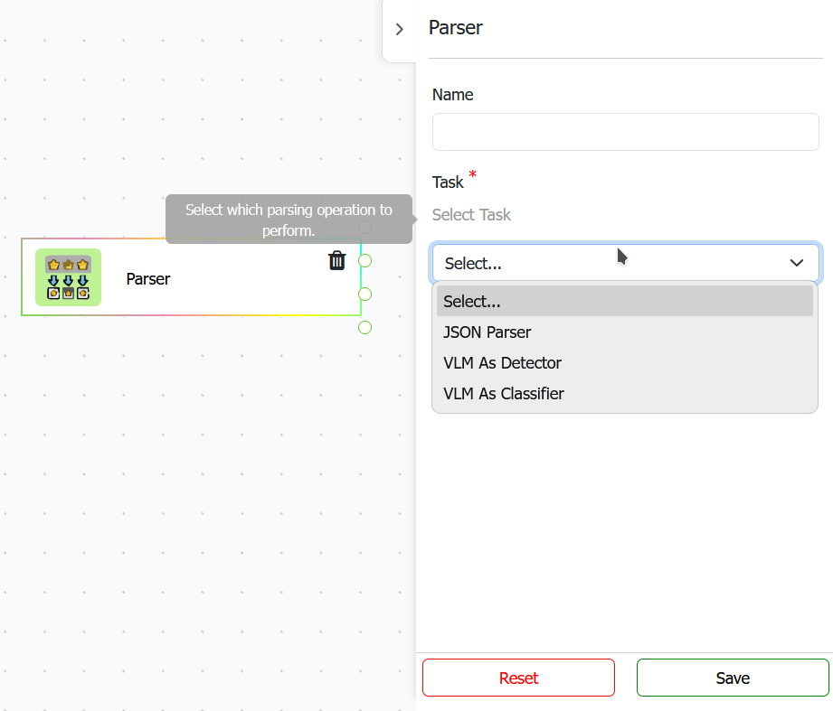
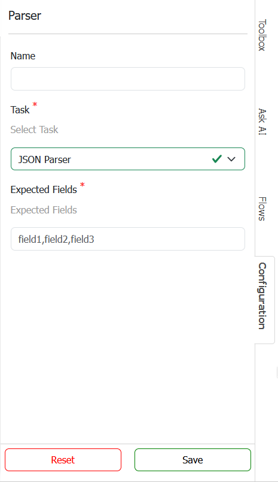
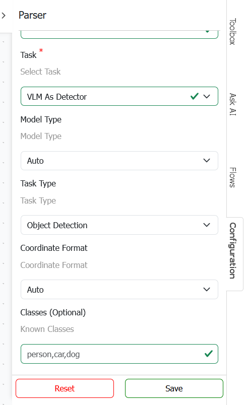
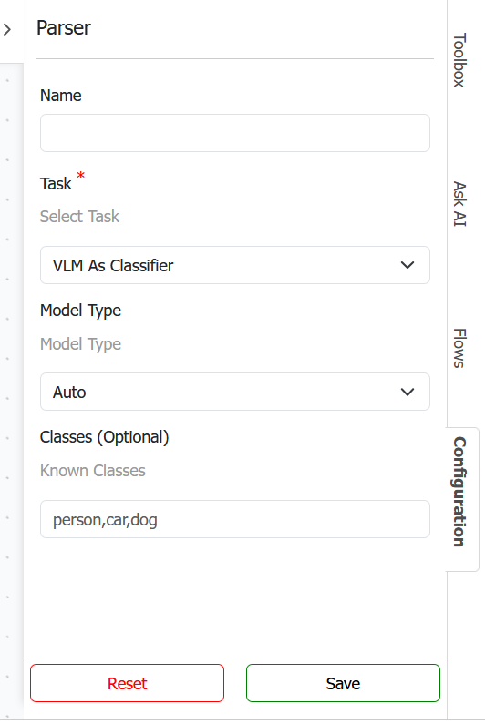
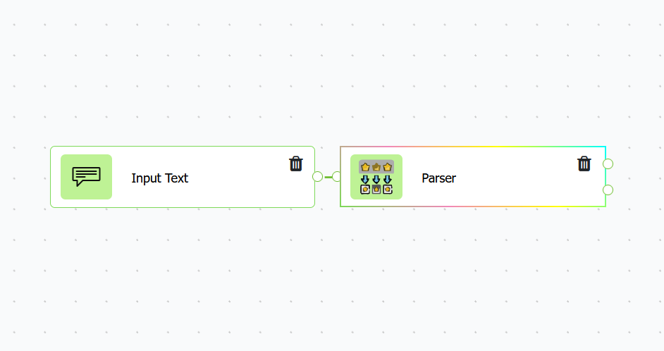
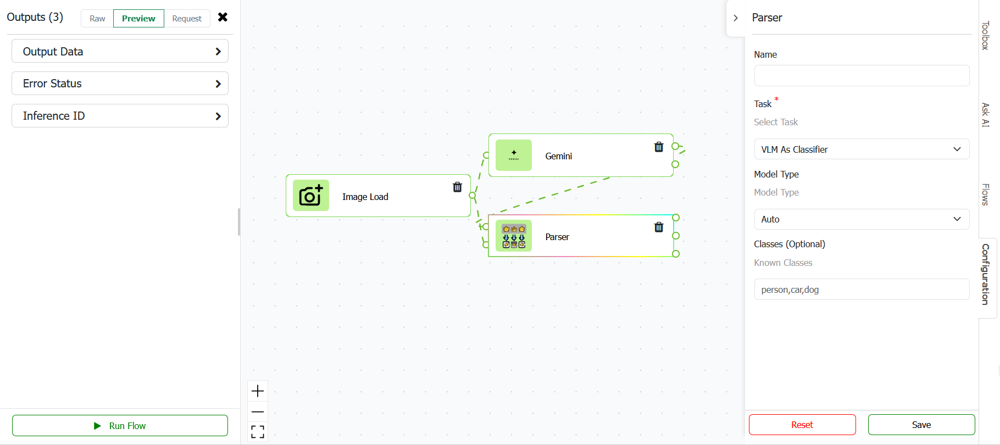
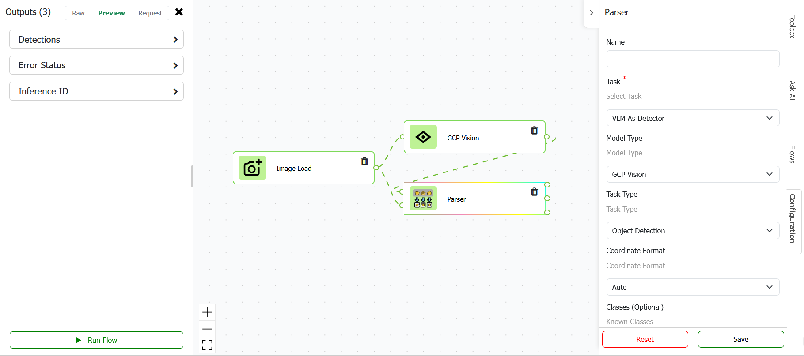

# Parser - DOCUMENTATION

---

## 1. Genel Bakış

### Paketin amacı ve ne yaptığı

Parser paketi, VLM/LLM modellerinden gelen ham metin çıktılarını ve yapılandırılmış verileri NovaVision platformunun standart formatlarına dönüştüren bir **component** uygulamasıdır. Bu paket:

- VLM/LLM modellerinden gelen ham JSON veya pseudo-JSON metinlerini parse eder
- Strict JSON, Markdown-wrapped JSON ve JavaScript-benzeri pseudo-JSON formatlarını destekler
- Kesintili (truncated) çıktılardan kurtarılabilir nesneleri salvage eder
- NovaVision output parametre envelope'larını otomatik olarak unwrap eder
- Detection çıktılarını NovaVision `Detection` formatına dönüştürür
- Classification çıktılarını standart NovaVision classification formatına dönüştürür
- Kullanıcı tanımlı class listesi ile class ID mapping yapar
- Class listesi verilmediğinde deterministic hash tabanlı auto ID üretir

### Temel özellikler

- ✅ Strict JSON, pseudo-JSON ve Markdown-wrapped JSON parse etme
- ✅ Kesintili (truncated) çıktılardan salvage ile kurtarma
- ✅ NovaVision / OpenAI / Claude envelope unwrap desteği
- ✅ Object detection çıktısı → NovaVision Detection formatı dönüşümü
- ✅ Single-label ve multi-label classification çıktısı dönüşümü
- ✅ Kullanıcı tanımlı class listesi ile ID mapping
- ✅ Class listesi olmadan deterministic auto ID üretimi
- ✅ Normalize edilmiş class name matching (case-insensitive, tire/boşluk duyarsız)
- ✅ Coordinate format desteği (0-1, 0-1000, pixel, auto)
- ✅ Model type bazlı parse davranışı
- ✅ Pydantic tabanlı model tanımları (girdi/çıktı/konfigürasyon)

### Desteklenen sınıflar / modeller / tipler

| ID | İsim | Açıklama |
|---|---|---|
| 1 | JsonParser | Ham JSON veya Markdown-wrapped JSON string'lerinden beklenen alanları çıkaran executor |
| 2 | VLMAsDetector | VLM/LLM detection çıktılarını NovaVision Detection formatına dönüştüren executor |
| 3 | VLMAsClassifier | VLM/LLM classification çıktılarını NovaVision classification formatına dönüştüren executor |
| 4 | PackageModel | Paket genel yapı tanımı (configs, executor vb.) |
| 5 | InputImage | Pydantic input modeli — single veya list image |
| 6 | InputRawText | Pydantic input modeli — str, dict veya list kabul eder |
| 7 | OutputData | Sınıflandırma veya JSON parse sonucu (dict veya list) |
| 8 | OutputDetections | Detection listesi çıktısı |
| 9 | OutputErrorStatus | Hata durumu göstergesi (bool) |
| 10 | OutputInferenceId | Her inference için benzersiz UUID |
| 11 | ParserHelper | Parse, repair, salvage, unwrap ve class mapping yardımcı sınıfı |

---

## 2. Mimari ve Teknolojiler

### Teknoloji Stack'i

- **Framework:** Python 3.x
- **Veri Yönetimi:** Redis (Image.get_frame / set_frame redis_db)
- **İşleme:** JSON parse, regex tabanlı repair, salvage algoritması
- **Validasyon:** Pydantic
- **SDK Bileşenleri:** `sdks.novavision` (Component, Image, PackageHelper, Executor)

### Her teknolojinin rolü ve kullanımı

| Teknoloji | Rol | Kullanım |
|---|---|---|
| Python 3.x | Ana programlama dili | Paket mantığı, Pydantic modeller, parse algoritmaları |
| json (stdlib) | JSON parse ve serialize | Strict JSON parse, repair sonrası parse |
| re (stdlib) | Regex işlemleri | Pseudo-JSON repair, key/value quoting, markdown extraction |
| uuid (stdlib) | Benzersiz ID üretimi | Her inference için inference_id üretimi |
| zlib (stdlib) | Hash hesaplama | Deterministic class ID üretimi (CRC32) |
| Pydantic | Input/Output/Config validasyonu | `PackageModel.py` içerisindeki modeller |
| sdks.novavision | SDK bileşenleri | Component, Image, Request/Response, PackageHelper |

### Proje yapısı

```
Parser/
 ├── LICENSE
 ├── README.md
 ├── DOCUMENTATION.md
 ├── setup.py
 ├── src/
 │   ├── __init__.py
 │   ├── executors/
 │   │   ├── JsonParser.py
 │   │   ├── VLMAsDetector.py
 │   │   └── VLMAsClassifier.py
 │   ├── models/
 │   │   └── PackageModel.py
 │   └── utils/
 │       ├── parser_helper.py
 │       └── response.py
```

**Açıklamalar:**

- `JsonParser.py` — Ham JSON veya pseudo-JSON metinlerinden beklenen alanları çıkaran executor.
- `VLMAsDetector.py` — VLM/LLM detection çıktılarını NovaVision Detection formatına dönüştüren executor.
- `VLMAsClassifier.py` — VLM/LLM classification çıktılarını standart classification formatına dönüştüren executor.
- `PackageModel.py` — Pydantic modeller: Input, Output, Config, Request, Response ve Executor tanımları.
- `parser_helper.py` — Parse, repair, salvage, unwrap ve class mapping işlemlerini yapan yardımcı sınıf.
- `response.py` — Executor context'inden çıkış modelini oluşturan builder fonksiyonları.

---

## 3. Executor'lar ve Çalışma Modları

### 3.1 `JsonParser`

**Tam path:** `src/executors/JsonParser.py`

**Amaç:** Ham JSON veya Markdown-wrapped JSON string'lerini parse etmek ve kullanıcı tarafından belirtilen alanları çıkarmak.

**Kullanım senaryosu:**

- ✅ VLM/LLM çıktısından belirli JSON alanlarını çıkarma
- ✅ Nested path ile veri çekme (örn: `employees[0].firstName`)
- ✅ Wildcard path desteği (örn: `employees[*].firstName`)

**İşleyiş:**

1. `inputRawText` üzerinden ham metin alınır
2. `ParserHelper.parse_json_text()` ile parse edilir (strict → repair → salvage)
3. `ConfigExpectedFields` ile belirtilen alanlar çıkarılır
4. Beklenen alan boşsa tüm parse edilmiş veri döndürülür
5. `build_json_parser_response()` ile response oluşturulur

**Python sınıfı:** `components.Parser.src.executors.JsonParser.JsonParser`

---

### 3.2 `VLMAsDetector`

**Tam path:** `src/executors/VLMAsDetector.py`

**Amaç:** VLM/LLM modellerinden gelen detection çıktılarını NovaVision `Detection` formatına dönüştürmek.

**Kullanım senaryosu:**

- ✅ Gemini, OpenAI, Claude gibi modellerin detection çıktılarını parse etme
- ✅ GCP Vision structured detection çıktılarını işleme
- ✅ Pseudo-JSON detection çıktılarını onarma ve dönüştürme
- ✅ Kesintili detection çıktılarından kurtarılabilir nesneleri salvage etme

**İşleyiş:**

1. `inputImage` üzerinden görüntü alınır ve boyutları belirlenir
2. `inputRawText` üzerinden ham metin veya yapılandırılmış veri alınır
3. `ParserHelper.parse_json_text()` ile parse edilir
4. `ParserHelper.unwrap_payload()` ile envelope açılır
5. `ParserHelper.extract_detection_items()` ile detection listesi çıkarılır
6. Her detection için:
   - `ParserHelper.extract_box_with_source()` ile bounding box çıkarılır
   - `ParserHelper.normalize_box()` ile koordinatlar normalize edilir
   - `ParserHelper.resolve_class_id()` ile class ID belirlenir
7. NovaVision `Detection` nesneleri oluşturulur
8. `build_vlm_as_detector_response()` ile response oluşturulur

**Python sınıfı:** `components.Parser.src.executors.VLMAsDetector.VLMAsDetector`

**Desteklenen koordinat formatları:**

| Format | Açıklama |
|---|---|
| `x_min, y_min, x_max, y_max` | Köşe koordinatları (normalize veya pixel) |
| `x, y, width, height` | Sol üst köşe + boyut |
| `cx, cy, width, height` | Merkez nokta + boyut |
| `boundingBox: {left, top, width, height}` | NovaVision standart format |
| `box_2d: [y_min, x_min, y_max, x_max]` | Gemini 0-1000 format |
| `vertices / normalizedVertices` | GCP Vision polygon format |

**Coordinate Format davranışı:**

| Format | Davranış |
|---|---|
| `auto` | Koordinat değerlerine göre otomatik tespit |
| `normalized-0-1` | Koordinatlar [0,1] aralığında kabul edilir, image boyutuna ölçeklenir |
| `normalized-0-1000` | Koordinatlar [0,1000] aralığında kabul edilir, image boyutuna ölçeklenir |
| `pixel` | Koordinatlar doğrudan pixel değeri olarak kabul edilir |

---

### 3.3 `VLMAsClassifier`

**Tam path:** `src/executors/VLMAsClassifier.py`

**Amaç:** VLM/LLM modellerinden gelen classification çıktılarını standart NovaVision classification formatına dönüştürmek.

**Kullanım senaryosu:**

- ✅ Single-label classification çıktılarını parse etme
- ✅ Multi-label classification çıktılarını parse etme
- ✅ Gemini, OpenAI, Claude gibi modellerin classification çıktılarını işleme
- ✅ Class listesi ile ID mapping yapma
- ✅ Class listesi olmadan auto ID üretme

**İşleyiş:**

1. `inputImage` üzerinden görüntü alınır ve boyutları belirlenir
2. `inputRawText` üzerinden ham metin veya yapılandırılmış veri alınır
3. `ParserHelper.parse_json_text()` ile parse edilir
4. `ParserHelper.unwrap_payload()` ile envelope açılır
5. `ParserHelper.detect_classification_format()` ile format tespit edilir (single/multi)
6. `ParserHelper.extract_classification_items()` ile class listesi çıkarılır
7. Her class için `ParserHelper.resolve_class_id()` ile ID belirlenir
8. Single veya multi-label formatında output oluşturulur
9. `build_vlm_as_classifier_response()` ile response oluşturulur

**Python sınıfı:** `components.Parser.src.executors.VLMAsClassifier.VLMAsClassifier`

**Classification format tespiti:**

| Format | Tespit koşulu |
|---|---|
| `single` | `class_name` + `confidence` içeren tek dict |
| `multi` | `predicted_classes` listesi veya dict listesi |
| `unknown` | Hiçbir format eşleşmez |

**Class ID mapping davranışı:**

| Durum | Davranış |
|---|---|
| ConfigClasses boş | Deterministic hash ID üretilir (CRC32 % 1000000) |
| ConfigClasses dolu, class listede var | Config listesindeki index kullanılır |
| ConfigClasses dolu, class listede yok | `class_id: -1` atanır |
| Normalize match (case/tire/boşluk) | Config listesindeki eşleşen index kullanılır |

---

## 4. Girdi (Input) Parametreleri

### 4.1 `InputImage`

```python
class InputImage(Input):
    name: Literal["inputImage"] = "inputImage"
    value: Union[List[Image], Image]
    type: str = "object"

    @validator("type", pre=True, always=True)
    def set_type_based_on_value(cls, value, values):
        value = values.get("value")
        if isinstance(value, Image):
            return "object"
        elif isinstance(value, list):
            return "list"

    class Config:
        title = "Image"
```

**Tanım:** Tek bir image veya image listesi alabilen input.

**Özellikler:**

- `name`: `"inputImage"` sabit değeri
- `value`: `Image` veya `List[Image]`
- `type`: `"object"` (tek) veya `"list"` (çoklu)

**Kullanıldığı executor'lar:** VLMAsDetector ✅, VLMAsClassifier ✅

---

### 4.2 `InputRawText`

```python
class InputRawText(Input):
    """
    Raw VLM/LLM text output. It can be plain JSON, Markdown-wrapped JSON,
    pseudo-JSON, or already structured data (dict/list) from upstream packages.
    """
    name: Literal["inputRawText"] = "inputRawText"
    value: Union[str, dict, list]
    type: str = "string"

    @validator("type", pre=True, always=True)
    def set_type_based_on_value(cls, value, values):
        value = values.get("value")
        if isinstance(value, str):
            return "string"
        elif isinstance(value, list):
            return "list"
        elif isinstance(value, dict):
            return "object"

    class Config:
        title = "Raw Text / Data"
```

**Tanım:** VLM/LLM modellerinden gelen ham çıktı. String, dict veya list kabul eder.

**Özellikler:**

- `name`: `"inputRawText"` sabit değeri
- `value`: `str` (ham metin), `dict` (yapılandırılmış veri) veya `list` (detection/classification listesi)
- `type`: Değere göre dinamik (`"string"`, `"object"`, `"list"`)

**Desteklenen formatlar:**

| Format | Örnek |
|---|---|
| Strict JSON | `{"detections": [...]}` |
| Pseudo-JSON | `{detections: [{class_name: person}]}` |
| Markdown-wrapped | `` ```json\n{...}\n``` `` |
| Structured dict | `{"boundingBox": {...}, "confidence": 0.9}` |
| Structured list | `[{"boundingBox": {...}}, {...}]` |
| NovaVision envelope | `{"name": "outputText", "value": "...", "type": "string"}` |

**Kullanıldığı executor'lar:** JsonParser ✅, VLMAsDetector ✅, VLMAsClassifier ✅

---

## 5. Konfigürasyon (Config) Parametreleri

### 5.1 `ConfigExpectedFields`

```python
class ConfigExpectedFields(Config):
    name: Literal["ConfigExpectedFields"] = "ConfigExpectedFields"
    value: str = Field(default="")
    type: Literal["string"] = "string"
    field: Literal["textInput"] = "textInput"
    placeHolder: Literal["field1,field2,field3"] = "field1,field2,field3"
```

**Tanım:** JSON parse sonucundan çıkarılacak alanların listesi.

**Desteklenen path formatları:**

| Format | Örnek | Açıklama |
|---|---|---|
| Basit alan | `name,age,result` | Root seviye alanlar |
| Nested path | `employees[0].firstName` | Belirli index |
| Wildcard | `employees[*].firstName` | Tüm elemanlar |
| Dot notation | `employees.firstName` | Implicit wildcard |

**Varsayılan:** `""` (boş — tüm parse edilmiş veri döndürülür)

**Kullanıldığı executor'lar:** JsonParser ✅

---

### 5.2 `ConfigModelType` (Detector)

```python
class ConfigModelType(Config):
    name: Literal["ConfigModelType"] = "ConfigModelType"
    value: Union[
        OptionModelAuto,
        OptionModelOpenAI,
        OptionModelGoogleGemini,
        OptionModelAnthropicClaude,
        OptionModelSpaceXAI,
        OptionModelFlorence2,
        OptionModelGCPVision,
        OptionModelQwenAI,
        OptionModelKimiAI
    ] = Field(default_factory=OptionModelAuto)
    type: Literal["object"] = "object"
    field: Literal["dropdownlist"] = "dropdownlist"
```

**Tanım:** Detection çıktısını üreten model tipi. Parse davranışını ve coordinate format tespitini etkiler.

**Seçenekler:**

| Seçenek | Değer | Açıklama |
|---|---|---|
| Auto | `auto` | Otomatik tespit (varsayılan) |
| OpenAI | `openai` | OpenAI GPT modelleri |
| Google Gemini | `google-gemini` | Google Gemini modelleri |
| Anthropic Claude | `anthropic-claude` | Anthropic Claude modelleri |
| SpaceXAI | `spacexai` | SpaceXAI (Grok) modelleri |
| Florence-2 | `florence-2` | Microsoft Florence-2 modeli |
| GCP Vision | `gcp-vision` | Google Cloud Vision API |
| Qwen AI | `qwen-ai` | Alibaba Qwen modelleri |
| Kimi AI | `kimi-ai` | Moonshot Kimi modelleri |

**Kullanıldığı executor'lar:** VLMAsDetector ✅

---

### 5.3 `ConfigClassifierModelType`

```python
class ConfigClassifierModelType(Config):
    name: Literal["ConfigClassifierModelType"] = "ConfigClassifierModelType"
    value: Union[
        OptionModelAuto,
        OptionModelOpenAI,
        OptionModelGoogleGemini,
        OptionModelAnthropicClaude,
        OptionModelSpaceXAI,
        OptionModelQwenAI,
        OptionModelKimiAI
    ] = Field(default_factory=OptionModelAuto)
    type: Literal["object"] = "object"
    field: Literal["dropdownlist"] = "dropdownlist"
```

**Tanım:** Classification çıktısını üreten model tipi.

**Not:** GCP Vision ve Florence-2 classifier model listesinde yer almaz çünkü bu modeller classification çıktısı üretmez.

**Kullanıldığı executor'lar:** VLMAsClassifier ✅

---

### 5.4 `ConfigTaskType`

```python
class ConfigTaskType(Config):
    name: Literal["ConfigTaskType"] = "ConfigTaskType"
    value: Union[
        OptionTaskObjectDetection,
        OptionTaskOpenVocabularyObjectDetection,
        OptionTaskObjectDetectionAndCaption,
        OptionTaskPhraseGroundedObjectDetection,
        OptionTaskRegionProposal,
        OptionTaskOcrWithTextDetection
    ] = Field(default_factory=OptionTaskObjectDetection)
    type: Literal["object"] = "object"
    field: Literal["dropdownlist"] = "dropdownlist"
```

**Tanım:** Detection task tipi. Model davranışını ve class ID atamasını etkiler.

**Seçenekler:**

| Seçenek | Değer | Açıklama |
|---|---|---|
| Object Detection | `object-detection` | Standart nesne tespiti (varsayılan) |
| Open Vocabulary Object Detection | `open-vocabulary-object-detection` | Açık kelime dağarcıklı tespit |
| Object Detection and Caption | `object-detection-and-caption` | Tespit + açıklama |
| Phrase Grounded Object Detection | `phrase-grounded-object-detection` | Phrase bazlı tespit |
| Region Proposal | `region-proposal` | Sınıf bağımsız bölge önerisi |
| OCR with Text Detection | `ocr-with-text-detection` | Metin tespiti ve tanıma |

**Task-specific davranışlar:**

| Task | Özel davranış |
|---|---|
| `region-proposal` | Class label zorla `"roi"` yapılır, bilinmeyen class ID `0` olur |
| `open-vocabulary-object-detection` | Bilinmeyen class ID `-1` olur, auto hash üretilmez |
| Diğer task'lar | Standart class mapping davranışı |

**Kullanıldığı executor'lar:** VLMAsDetector ✅

---

### 5.5 `ConfigCoordinateFormat`

```python
class ConfigCoordinateFormat(Config):
    name: Literal["ConfigCoordinateFormat"] = "ConfigCoordinateFormat"
    value: Union[
        OptionCoordinateAuto,
        OptionCoordinateNormalized01,
        OptionCoordinateNormalized01000,
        OptionCoordinatePixel
    ] = Field(default_factory=OptionCoordinateAuto)
    type: Literal["object"] = "object"
    field: Literal["dropdownlist"] = "dropdownlist"
```

**Tanım:** Detection çıktısındaki koordinatların formatı.

**Seçenekler:**

| Seçenek | Değer | Açıklama |
|---|---|---|
| Auto | `auto` | Koordinat değerlerine göre otomatik tespit (varsayılan) |
| Normalized 0-1 | `normalized-0-1` | [0,1] aralığında normalize koordinatlar |
| Normalized 0-1000 | `normalized-0-1000` | [0,1000] aralığında normalize koordinatlar |
| Pixel | `pixel` | Doğrudan pixel koordinatları |

**Kullanıldığı executor'lar:** VLMAsDetector ✅

---

### 5.6 `ConfigClasses`

```python
class ConfigClasses(Config):
    """
    Optional class list used for mapping class names to class IDs.
    If provided, known classes are mapped to their index in this list.
    Unknown classes receive class_id -1.
    If left empty, classes are auto-detected and deterministic hash IDs are generated.
    """
    name: Literal["ConfigClasses"] = "ConfigClasses"
    value: str = Field(default="")
    type: Literal["string"] = "string"
    field: Literal["textInput"] = "textInput"
    placeHolder: Literal["Optional: person,car,dog"] = "Optional: person,car,dog"
```

**Tanım:** Opsiyonel class listesi. Class name → class ID mapping için kullanılır.

**Davranış:**

| Durum | class_id davranışı |
|---|---|
| Config boş | Deterministic hash ID (CRC32 % 1000000) |
| Config dolu, class listede var | Config index'i (0, 1, 2, ...) |
| Config dolu, class listede yok | `-1` |

**Normalize matching:**

Class name eşleştirmesi normalize edilir:

```text
Person == person == PERSON
T-Shirt == t-shirt == t shirt == t_shirt
Group Of People == group of people == group-of-people
```

**Kullanıldığı executor'lar:** JsonParser ❌, VLMAsDetector ✅, VLMAsClassifier ✅

---

## 6. Çıktı (Output) Parametreleri

### 6.1 `OutputData`

```python
class OutputData(Output):
    name: Literal["outputData"] = "outputData"
    value: Union[dict, list]
    type: str = "object"
```

**Tanım:** JsonParser veya VLMAsClassifier çıktısı.

**Kullanıldığı executor'lar:** JsonParser ✅, VLMAsClassifier ✅

---

### 6.2 `OutputDetections`

```python
class OutputDetections(Output):
    name: Literal["outputDetections"] = "outputDetections"
    value: List[Detection]
    type: Literal["list"] = "list"
```

**Tanım:** VLMAsDetector tarafından üretilen detection listesi.

**Yapı örneği:**

```json
{
  "name": "outputDetections",
  "type": "list",
  "value": [
    {
      "boundingBox": {
        "left": 174.2,
        "top": 254.27,
        "width": 105.3,
        "height": 453.04
      },
      "confidence": 0.9,
      "classLabel": "person",
      "classId": 886774
    }
  ]
}
```

**Kullanıldığı executor'lar:** VLMAsDetector ✅

---

### 6.3 `OutputErrorStatus`

```python
class OutputErrorStatus(Output):
    name: Literal["outputErrorStatus"] = "outputErrorStatus"
    value: bool
    type: Literal["bool"] = "bool"
```

**Tanım:** Parse veya işleme hatası olup olmadığını gösterir.

**Kullanıldığı executor'lar:** JsonParser ✅, VLMAsDetector ✅, VLMAsClassifier ✅

---

### 6.4 `OutputInferenceId`

```python
class OutputInferenceId(Output):
    name: Literal["outputInferenceId"] = "outputInferenceId"
    value: str
    type: Literal["string"] = "string"
```

**Tanım:** Her inference için benzersiz UUID. Aynı frame içindeki tüm output'lar aynı inference_id'yi paylaşır.

**Kullanıldığı executor'lar:** VLMAsDetector ✅, VLMAsClassifier ✅

---

## 7. Veri Modelleri

### PackageModel hiyerarşisi

```
PackageModel (Package)
├── configs (PackageConfigs)
│   └── executor (ConfigExecutor)
│       └── value (Union: JsonParser | VLMAsDetector | VLMAsClassifier)
│           └── value (Request | Response)
│               ├── inputs
│               │   ├── JsonParser: inputRawText
│               │   ├── VLMAsDetector: inputImage, inputRawText
│               │   └── VLMAsClassifier: inputImage, inputRawText
│               ├── configs
│               │   ├── JsonParser: expectedFields
│               │   ├── VLMAsDetector: modelType, taskType, coordinateFormat, classes
│               │   └── VLMAsClassifier: modelType, classes
│               └── outputs
│                   ├── JsonParser: outputData, outputErrorStatus
│                   ├── VLMAsDetector: outputDetections, outputErrorStatus, outputInferenceId
│                   └── VLMAsClassifier: outputData, outputErrorStatus, outputInferenceId
```

### Request / Response akışları

```
[Client] ----JSON Request----> [PackageModel (configs->executor)]
      |
      V
[Executor: JsonParser | VLMAsDetector | VLMAsClassifier] --run()
      |
      V
1. Parse raw input (strict → repair → salvage)
2. Unwrap payload envelopes
3. Extract detection/classification items
4. Resolve class IDs
5. Build NovaVision format output
6. build_response(context) -> PackageHelper -> PackageModel Response JSON
      |
      V
[Client] <- JSON Response
```

---

## 8. Metodoloji ve Algoritmalar



### 8.1 JSON Parse Pipeline

**Amaç:** VLM/LLM modellerinden gelen ham çıktıyı güvenilir şekilde parse etmek.

**Adımlar:**

1. Gelen veri dict/list ise doğrudan kullan
2. Markdown JSON bloğunu çıkar (varsa)
3. Strict JSON parse dene (`json.loads`)
4. Raw JSON decode dene (gömülü JSON için)
5. Pseudo-JSON repair uygula (tırnaksız key/value'ları düzelt)
6. Repair edilmiş metni strict parse dene
7. Repair edilmiş metni raw decode dene
8. Salvage uygula (kesintili metinden tam nesneleri çıkar)
9. Başarılı sonuç yoksa `None` döndür

**Pseudo-code:**

```
def parse_json_text(raw_text):
    if raw_text is dict/list: return raw_text

    candidates = [markdown_extract(text), text]

    for candidate in candidates:
        result = strict_json(candidate)
        if result: return result

        result = raw_decode(candidate)
        if result: return result

        repaired = repair_pseudo_json(candidate)
        result = strict_json(repaired)
        if result: return result

        result = raw_decode(repaired)
        if result: return result

        salvaged = salvage_objects(candidate)
        if salvaged: return salvaged

        salvaged = salvage_objects(repaired)
        if salvaged: return salvaged

    return None
```

### 8.2 Pseudo-JSON Repair

**Amaç:** VLM modellerinin ürettiği JavaScript-benzeri pseudo-JSON yapılarını geçerli JSON'a dönüştürmek.

**Desteklenen düzeltmeler:**

| Sorun | Düzeltme |
|---|---|
| Tırnaksız key'ler | `class_name:` → `"class_name":` |
| Tırnaksız string value'lar | `class: person` → `"class": "person"` |
| Trailing comma | `{"a": 1,}` → `{"a": 1}` |
| Literal `\n` escape dizileri | Gerçek newline'a dönüştürülür |
| Boşluklu string value'lar | `class: group of people` → `"class": "group of people"` |

### 8.3 Salvage Algoritması

**Amaç:** Token limiti veya kesinti nedeniyle yarım kalmış çıktılardan kurtarılabilir tam nesneleri çıkarmak.

**Adımlar:**

1. Metin içinde `{` karakterlerini tara
2. Her `{` için balanced closing `}` bul
3. Balanced nesne bulunursa repair + parse et
4. Parse başarılıysa listeye ekle
5. Balanced değilse (kesintili) atla, sonraki `{`'a geç
6. Tüm tam nesneleri list olarak döndür

**Örnek:**

```text
Input (kesintili):
{detections: [{x_min: 0.15, class_name: person, confidence: 0.9}, {x_min: 0.35, y_

Salvage output:
[{"x_min": 0.15, "class_name": "person", "confidence": 0.9}]
```

İlk detection tam olduğu için kurtarılır, ikinci detection kesintili olduğu için atlanır.

### 8.4 Payload Unwrap

**Amaç:** NovaVision output parametre envelope'larını ve LLM API response yapılarını otomatik olarak açmak.

**Desteklenen envelope'lar:**

| Envelope | Yapı |
|---|---|
| NovaVision param | `{"name": "...", "value": "...", "type": "string"}` |
| OpenAI | `{"choices": [{"message": {"content": "..."}}]}` |
| Claude | `{"content": [{"type": "text", "text": "..."}]}` |

### 8.5 Class ID Resolution

**Amaç:** Class name'leri tutarlı ve tekrarlanabilir class ID'lere eşlemek.

**Adımlar:**

1. Class listesi boşsa → deterministic hash ID üret (CRC32 % 1000000)
2. Class listesi doluysa:
   a. Exact match ara
   b. Normalize match ara (case-insensitive, tire/boşluk duyarsız)
   c. Eşleşme bulunursa → config index'i kullan
   d. Eşleşme bulunamazsa → `class_id: -1` ata

**Pseudo-code:**

```
def resolve_class_id(class_name, class_list, class_map, normalized_map):
    if not class_name: return "", -1

    if not class_list:
        return class_name, generate_hash_id(class_name)

    if class_name in class_map:
        return class_list[class_map[class_name]], class_map[class_name]

    normalized = normalize(class_name)
    if normalized in normalized_map:
        idx = normalized_map[normalized]
        return class_list[idx], idx

    return class_name, -1
```

---

## 9. Test Notları ve Doğrulama Sonuçları

### 9.1 Gemini Object Detection Testi

**Model:** Google Gemini
**Task:** Object Detection
**Model Type:** `google-gemini`
**Coordinate Format:** `auto`

**Gemini raw output (pseudo-JSON):**

```json
{
  "name": "output",
  "value": "{detections: [{x_min: 0.134, y_min: 0.252, x_max: 0.215, y_max: 0.701, class_name: person, confidence: 0.9}, {x_min: 0.174, y_min: 0.316, x_max: 0.266, y_max: 0.751, class_name: person, confidence: 0.89}, ...]}",
  "type": "string"
}
```

**Classes config:**

```json
{
  "name": "classes",
  "value": ["person"],
  "type": "list"
}
```

**Parser output (15 detection başarıyla parse edildi):**

```json
{
  "name": "outputDetections",
  "value": [
    {
      "boundingBox": {
        "left": 174.20000000000002,
        "top": 254.268,
        "width": 105.29999999999998,
        "height": 453.04099999999994
      },
      "confidence": 0.9,
      "classLabel": "person",
      "classId": 886774
    },
    ...
  ],
  "type": "list"
}
```

**Sonuç:** ✅ Başarılı. Pseudo-JSON repair edildi, 15 detection parse edildi, koordinatlar image boyutuna ölçeklendi, class config boş olduğu için deterministic hash ID atandı.

---

### 9.2 Gemini Multi-Label Classification Testi

**Model:** Google Gemini
**Task:** Multi-label Classification

**Gemini raw output (pseudo-JSON):**

```json
{
  "name": "output",
  "value": "{\n  predicted_classes: [\n    {class: person, confidence: 0.99},\n    {class: clothing, confidence: 0.98},\n    {class: man, confidence: 0.97},\n    {class: woman, confidence: 0.97},\n    {class: jeans, confidence: 0.95},\n    {class: shirt, confidence: 0.95},\n    {class: t-shirt, confidence: 0.92},\n    {class: trousers, confidence: 0.9},\n    {class: footwear, confidence: 0.9}\n  ]\n}",
  "type": "string"
}
```

**Parser output:**

```json
{
  "name": "outputData",
  "value": {
    "type": "multi-label-classification",
    "width": 1300,
    "height": 1009,
    "inference_id": "b5a0718e-9034-4ad8-a496-c0ceb55177ff",
    "parent_id": "b5a0718e-9034-4ad8-a496-c0ceb55177ff",
    "predicted_classes": [
      {"class_name": "person", "class_id": 886774, "confidence": 0.99},
      {"class_name": "clothing", "class_id": 5233, "confidence": 0.98},
      {"class_name": "man", "class_id": 263384, "confidence": 0.97},
      {"class_name": "woman", "class_id": 24349, "confidence": 0.97},
      {"class_name": "jeans", "class_id": 318584, "confidence": 0.95},
      {"class_name": "shirt", "class_id": 906896, "confidence": 0.95},
      {"class_name": "t-shirt", "class_id": 35875, "confidence": 0.92},
      {"class_name": "trousers", "class_id": 936890, "confidence": 0.9},
      {"class_name": "footwear", "class_id": 888065, "confidence": 0.9}
    ],
    "predictions": {
      "predicted_classes": [...]
    }
  },
  "type": "object"
}
```

**Sonuç:** ✅ Başarılı. Pseudo-JSON repair edildi, 9 class parse edildi, multi-label format doğru üretildi, deterministic hash ID'ler atandı.

---

### 9.3 Gemini Single-Label Classification Testi

**Model:** Google Gemini
**Task:** Single-label Classification

**Gemini raw output:**

```json
{
  "name": "output",
  "value": "{class_name: group of people, confidence: 0.99}",
  "type": "string"
}
```

**Parser output:**

```json
{
  "name": "outputData",
  "value": {
    "type": "classification",
    "width": 1300,
    "height": 1009,
    "inference_id": "3158fc7d-c1e7-4fd6-a2e3-b4ad1ced79d9",
    "parent_id": "3158fc7d-c1e7-4fd6-a2e3-b4ad1ced79d9",
    "top": {
      "class_name": "group of people",
      "class_id": 250314,
      "confidence": 0.99
    },
    "confidence": 0.99,
    "predictions": [
      {"class_name": "group of people", "class_id": 250314, "confidence": 0.99}
    ]
  },
  "type": "object"
}
```

**Sonuç:** ✅ Başarılı. Boşluklu class name (`group of people`) doğru parse edildi, single-label format doğru üretildi.

---

### 9.4 OpenAI Object Detection Testi

**Model:** OpenAI GPT-4o (non-thinking, default config)
**Task:** Object Detection

**OpenAI raw output (pseudo-JSON):**

```json
{
  "name": "outputText",
  "value": "{\n  detections: [\n    {\n      x_min: 0.15,\n      y_min: 0.25,\n      x_max: 0.25,\n      y_max: 0.75,\n      class_name: person,\n      confidence: 0.9\n    },\n    ...\n  ]\n}",
  "type": "string"
}
```

**Sonuç:** ✅ Başarılı. Pseudo-JSON repair edildi, detection'lar parse edildi.

---

### 9.5 OpenAI Envelope Testi (Input Text üzerinden)

**Senaryo:** OpenAI paketinden kaynaklanan çıktı göndermeme sorunu nedeniyle OpenAI çıktısı Input Text paketine kopyalandığında oluşan envelope'lu yapı.

**Input Text output (envelope'lu pseudo-JSON):**

```json
{
  "name": "outputText",
  "value": "{     name: outputText,     value: {\n  detections: [\n    {\n      x_min: 0.15,\n      y_min: 0.25,\n      x_max: 0.25,\n      y_max: 0.75,\n      class_name: person,\n      confidence: 0.9\n    },\n    ...\n  ]\n},     type: string,     listen: continuous,     branch: forward }",
  "type": "string"
}
```

**Sonuç:** ✅ Başarılı. Envelope unwrap edildi, literal `\n` escape dizileri temizlendi, detection'lar parse edildi.

---

### 9.6 Truncated Output Salvage Testi

**Senaryo:** Token limiti nedeniyle kesintiye uğramış Gemini detection çıktısı.

**Kesintili raw output:**

```json
{
  "name": "output",
  "value": "{detections: [{x_min: 0.133, y_min: 0.251, x_max: 0.209, y_max: 0.699, class_name: person, confidence: 0.94}, {x_min: 0.177, y_min: 0.296, x_max: 0.273, y_max:",
  "type": "string"
}
```

**Sonuç:** ✅ Başarılı. Salvage algoritması ilk tam detection'ı kurtardı, ikinci kesintili detection atlandı. `error_status: false`, 1 detection döndü.

---

### 9.7 GCP Vision Detection Testi

**Model:** GCP Vision paketi
**Task:** Object Detection

**GCP Vision output (structured list):**

```json
{
  "name": "outputDetections",
  "value": [
    {
      "boundingBox": {"left": 255, "top": 439, "width": 75, "height": 112},
      "confidence": 0.7893872261047363,
      "classLabel": "Top",
      "classId": -1,
      "imgUID": "d6adb3e0-8dac-44fe-b651-4da8b3d62027"
    },
    ...
  ],
  "type": "list"
}
```

**Parser output:**

```json
{
  "name": "outputDetections",
  "value": [
    {
      "boundingBox": {"left": 255, "top": 439, "width": 75, "height": 112},
      "confidence": 0.7893872261047363,
      "classLabel": "Top",
      "classId": -1
    },
    ...
  ],
  "type": "list"
}
```

**Sonuç:** ✅ Başarılı. GCP Vision structured list çıktısı doğrudan işlendi. `inputRawText` tipi `Union[str, dict, list]` olarak genişletildiği için list input kabul edildi. `classLabel` alanı CLASS_KEYS listesine eklenerek doğru okundu. Pixel koordinatlar olduğu gibi korundu.

**Not:** GCP Vision sadece detection yaptığı için classifier model type listesinden çıkarılmıştır.

---

### 9.8 Test Edilemeyen Modeller ve Task'lar

| Model / Task | Neden test edilemedi |
|---|---|
| Anthropic Claude | Anthropic API Key mevcut değil |
| Alibaba Qwen | Open Router API Key mevcut değil |
| Moonshot Kimi | Open Router API Key mevcut değil |
| Florence-2 | NovaVision platformunda bulunmuyor |
| SpaceXAI (GrokAI) | NovaVision platformunda bulunmuyor |
| Open Vocabulary Object Detection | Test edilen modeller desteklemiyor |
| Object Detection and Caption | Test edilen modeller desteklemiyor |
| Phrase Grounded Object Detection | Test edilen modeller desteklemiyor |
| Region Proposal | Test edilen modeller desteklemiyor |
| OCR with Text Detection | Test edilen modeller desteklemiyor |

---


## 10. ParserHelper Referansı

### Anahtar listeleri

| Liste | İçerik | Kullanım |
|---|---|---|
| `CLASS_KEYS` | `class_name`, `className`, `class`, `classLabel`, `label`, `object`, `object_name`, `name`, `category`, `category_name`, `description`, `tag`, `entity`, `text` | Class name tespiti |
| `CONFIDENCE_KEYS` | `confidence`, `score`, `prob`, `probability`, `conf`, `topicality`, `likelihood`, `scores`, `probabilities` | Confidence tespiti |
| `DETECTION_LIST_KEYS` | `detections`, `predictions`, `objects`, `boxes`, `results`, `items`, `data`, `labels`, `localizedObjectAnnotations`, `labelAnnotations`, `faceAnnotations`, `textAnnotations`, `annotations`, `responses` | Detection listesi tespiti |
| `BOX_KEYS` | `boundingBox`, `bounding_box`, `bbox`, `box`, `box_2d`, `coordinates`, `coords`, `rect`, `region`, `boundingPoly`, `normalizedVertices`, `vertices`, `location` | Bounding box tespiti |

### Temel metodlar

| Metod | Açıklama |
|---|---|
| `parse_json_text(raw_text)` | Parse + unwrap pipeline |
| `_parse_json_text_raw(raw_text)` | Strict → repair → salvage parse pipeline |
| `_repair_json_like_text(text)` | Pseudo-JSON düzeltme |
| `_salvage_objects(text)` | Kesintili metinden tam nesne kurtarma |
| `unwrap_payload(parsed_data)` | Envelope açma |
| `extract_detection_items(parsed_data)` | Detection listesi çıkarma |
| `extract_classification_items(parsed_data)` | Classification item listesi çıkarma |
| `detect_classification_format(parsed_data)` | Single/multi format tespiti |
| `extract_box_with_source(item)` | Bounding box çıkarma (kaynak bilgisiyle) |
| `normalize_box(box, w, h, source, format, model)` | Koordinat normalizasyonu |
| `resolve_class_id(class_name, list, map, nmap)` | Class ID resolution |
| `parse_classes(raw_classes)` | Class listesi parse etme |
| `generate_class_id(class_name)` | Deterministic hash ID üretimi |

---

## 11. Görseller


Where is it on toolbox menu


All Executors


JsonParser Configs


VLMAsDetector Configs


VLMAsClassifier Configs


Example Flow with JsonParser Use


Example Flow with Gemini Use


Example Flow with GCP Vision Use

---

## 12. Geliştirme Kontrol Listesi

- [x] Package structure matches template
- [x] PackageModel.py follows bottom-up construction
- [x] All inputs/outputs properly defined with camelCase name properties
- [x] Config name properties use PascalCase (options use camelCase)
- [x] Config fields use supported types
- [x] Executor class name matches file name and model name
- [x] Response builder imports all required classes
- [x] Error handling implemented (outputErrorStatus)
- [x] Pseudo-JSON repair tested with Gemini and OpenAI outputs
- [x] Salvage algorithm tested with truncated outputs
- [x] Envelope unwrap tested with NovaVision param structure
- [x] GCP Vision structured list input tested
- [x] Class ID mapping tested (config-based and auto hash)
- [x] Normalize class name matching tested
- [ ] Claude, Qwen, Kimi model testleri (API key gerekli)
- [ ] Florence-2, SpaceXAI testleri (platformda mevcut değil)
- [ ] Diğer detection task testleri (model desteği gerekli)

---

## 13. Geliştirme Geçmişi

Parser paketi aşağıdaki fazlarda geliştirilmiştir:

| Faz | Versiyon | Açıklama |
|---|---|---|
| 1 | v0.1.0 | İlk sürüm: 3 executor, temel parse pipeline |
| 2 | v0.2.0 | Pseudo-JSON repair ve envelope unwrap |
| 3 | v0.3.0 | Nested JSON erişim ve recursive key search |
| 4 | v0.4.0 | JSON parse refactor (modüler yapı) |
| 5 | v0.5.0 | Class ID normalizasyon ve hash tabanlı auto ID |
| 6 | v0.6.0 | Çoklu model desteği, coordinate format, GCP Vision anahtarları |
| 7 | v0.7.0 | Salvage algoritması (kesintili çıktı kurtarma) |
| 8 | v0.8.0 | InputRawText tip genişletme (str/dict/list) |
| 9 | v0.9.0 | GCP Vision entegrasyonu (classLabel, classifier'dan çıkarma) |
| 10 | v1.0.0 | Final temizlik ve düzenleme |